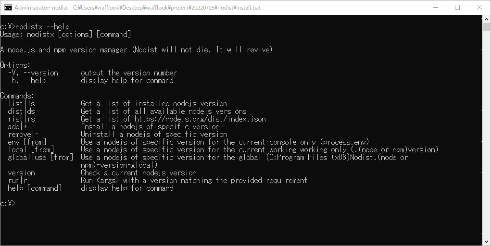

## 🐿️ Nodistx
NODEJS/NPMをセットでインストールできる最速のマネージャだ。バージョンを選択するだけ。後は何をするのも自由だ。カップ麺やコーヒーを淹れている間に、必要なパッケージをインストールして動作する状態にしてくれる



## 📡 Installing
install.batを走らせるだけ。このインストーラはGITHUB CLIENTを最新にして本家ISSUEのいくつかの問題を解決する

| 解決 | https://github.com/nullivex/nodist/pulls              |
|:--:|:--------------------------------------------------------|
| 〇 | Use the Octokit client for GitHub                       |

| 解決 | https://github.com/nullivex/nodist/issues/            |
|:--:|:--------------------------------------------------------|
|	〇 | 无法安装 npm                                             |
|	〇 | Invalid Version: libnpmversion-v3.0.1.                  |
|	〇 | npm 8.6, authorization header missing & symlink problem |

このバッチファイルはNODISTのインストールを行うが、依存パッケージを最新にして既存のNODISTが存在すれば削除する（C:\Program Files (x86)\Nodist）更に、レート制限にひっかからないようGITHUBのAPI KEY の設定を促す
## 💻 Support version latest >= v6.2.0/3.8.9

これ未満のバージョンをインストールしたいならNODIST本体のコマンドを走らせてほしい。こうする理由は入力を受け付けなくなるからだ。v6.1.0からカーソルキーが反応しなくなって一覧を操作できない。原因わかる方々いる？

```bat
C:>nodist global 6.2.0 && nodist npm global 3.8.9
```
 <table>
   <thead>
     <tr>
       <th>更新</th>
       <th>C:\Program Files (x86)\Nodist\package.json</th>
    </tr>
  </thead>
   <tbody>
     <tr>
       <td>ansi-styles-4.3.0.tgz</td>
       <td rowspan='6'>
         <p>v6.2.0で走らせるために依存パッケージにポリフィルを適用した。</p>
         <p>v6.2.0で動作するかテストしてコミットする必要あり</p>
         <ul>
           <li>nodejs v6.2.0</li>
           <li>npm 3.8.9</li>
        </ul>
      </td>
    </tr>
     <tr>
       <td>chalk-4.1.2.tgz</td>
    </tr>
     <tr>
       <td>commander-9.4.0.tgz</td>
    </tr>
     <tr>
       <td>inquirer-8.2.4.tgz</td>
    </tr>
     <tr>
       <td>ora-5.4.1.tgz</td>
    </tr>
     <tr>
       <td>wrap-ansi-7.0.0.tgz</td>
    </tr>
  </tbody>
</table>

## 📦 Example

`nodistx use`を走らせるとバージョンが切り替わる。未インストールのバージョンは自動インストールされNＰＭのnode_modules/シンボリックリンクは張り直される。このリンクファイルの作成には管理者権限がいるため自動的にadd/env/local/global コマンドはRUNASで起動する。バージョン使用の優先順位は、env>package.json>local>global

```bat
C:>nodistx use ls インストールしたバージョンを選択できます
C:>nodistx use ds インストールしてないバージョンを選択できます（自動インストールされます）
C:>nodistx use rs インストールしてないしたを一覧化して全バージョンから選択できます（https://nodejs.org/dist/index.json）
```

```bat
C:>nodistx --help
Usage: nodistx [options] [command]

A node.js and npm version manager（Nodist will not die. It will revive）

Options:
  -V, --version      output the version number
  -h, --help         display help for command

Commands:
  list|ls            Get a list of installed nodejs version
  dist|ds            Get a list of all available nodejs versions
  rist|rs            Get a list of https://nodejs.org/dist/index.json
  add|+              Install a nodejs of specific version
  remove|-           Uninstall a nodejs of specific version
  env [from]         Use a nodejs of specific version for the current console only (process.env)
  local [from]       Use a nodejs of specific version for the current working working only (.(node or npm)version)
  global|use [from]  Use a nodejs of specific version for the global (C:Program Files (x86)Nodist.(node or
                     npm)-version-global)
  version            Check a current nodejs version
  run|r              Run <args> with a version matching the provided requirement
  help [command]     display help for command
```
## 💙 Special Thanks

これを作る機会をくれた私の愛する村山に感謝します。結婚しよう。君の近くにいられて幸せなことを全員の前で誓いたい。話そう。１２月２６日をやり直したいんだ。村山さん。君に愛されたい。心から

## 😊 Thanks
* Sebastian/[cmd - Is there a command to refresh environment variables from the command prompt in Windows? - Stack Overflow](https://stackoverflow.com/questions/171588/is-there-a-command-to-refresh-environment-variables-from-the-command-prompt-in-w)
* ウィンドウズスクリプトプログラマ/[unix tee擬似バッチファイル(その２): Windows Script Programming](http://scripting.cocolog-nifty.com/blog/2007/03/unix_tee_11d0.html)
* fealebenpae/[Use the Octokit client for GitHub by fealebenpae · Pull Request #246 · nullivex/nodist](https://github.com/nullivex/nodist/pull/246)
* madumal7/[npm ERR! Cannot read property 'startsWith' of null · Issue #19719 · npm/npm](https://github.com/npm/npm/issues/19719)
* SBoudrias/[Inquirer.js: A collection of common interactive command line user interfaces.](https://github.com/SBoudrias/Inquirer.js/)
* dbenham/[windows - Using a custom Tee command for .bat file - Stack Overflow](https://stackoverflow.com/questions/10711839/using-a-custom-tee-command-for-bat-file/10719322#10719322)
* eduardoboucas/[inquirer-table-prompt: A table-like prompt for Inquirer](https://github.com/eduardoboucas/inquirer-table-prompt)
* nullivex/[nodist: Natural node.js and npm version manager for windows.](https://github.com/nullivex/nodist)
* dbenham/[How to catch DEL errors? It's possible? - DosTips.com](https://www.dostips.com/forum/viewtopic.php?t=7054)
* freMea/[My batch/cmd template](https://gist.github.com/freMea/0e907150d14e68f26794207fbeec8fa0)
* lewish/[asciiflow: ASCIIFlow](https://github.com/lewish/asciiflow)
## 👍 Supported nodist commands

NODISTのコマンドをラップした一覧です。バージョン指定はNODISTX側でTABLE-PROMPTに置き換えられています

```
nodist                          List all installed node versions.
nodist list
nodist ls

nodist dist                     List all available (not installed) node versions.
nodist ds

nodist add <version>            Install the latest published version matching <version>;
nodist + <version>              if any set requirement matches this version, this will get referenced in the future.

nodist rm <version>             Uninstall the latest installed version matching <version>;
nodist - <version>              if any set requirement matches this <version>, it will try to reference another installed version.

nodist global <ver-req>         installs the specified node version if it hasn't been installed.

nodist local <ver-req>          Set the local requirement for this directory and its subdirectories;
                                adds or updates the ./node-version file.

nodist env <ver-req>            Set the requirement for the current environment only
                                (usually the current terminal window).

nodist run <ver-req> -- <args>  Run <args> with a version matching the provided requirement
nodist r <ver-req> -- <args>    (will abort if no matching version is installed).
```
## 👍 new commands

リリース全一覧を取得します。インストール済はlistから未インストールはdistから抽出できます。installedフラグを追加したのでインストール済か否かをリリース全一覧から確認できます。list/dist/rist ３つから一覧を選択できます

```
nodist rist                     List all from https://nodejs.org/dist/index.json
nodist rs
```
## 👍 low

サポート外です。

```
nodist <ver-req>                Set the global version requirement;

nodist bin <ver-req>            Get the path to the specified node <version>
                                (installs the node <version>, if necessary).

nodist path <ver-req>           Get the path to the specified node <version> directory
                                (installs the node <version>, if necessary).

nodist npm <ver-req>            Set the global npm version requirement.
                                (installs the npm <version>, if necessary).

nodist npm match                Activate the npm version matching the active node version
                                (active node version depends on env/local/global requirements).

nodist --help                   Display this help.

nodist -v                       Display nodist version.
```

``` javascript
 /*
  * 基本
  *   nodist dist
  *   https://iojs.org/dist/index.json
  *   https://nodejs.org/dist/index.json
  *   C:\Program Files (x86)\Nodist\versions.json
  *   [
  *     {
  *       "version":"v18.5.0",
  *       "date":"2022-07-06",
  *       "files":[
  *         "aix-ppc64",
  *         "headers",
  *         "linux-arm64",
  *         "linux-armv7l",
  *         "linux-ppc64le",
  *         "linux-s390x",
  *         "linux-x64",
  *         "osx-arm64-tar",
  *         "osx-x64-pkg",
  *         "osx-x64-tar",
  *         "src",
  *         "win-x64-7z",
  *         "win-x64-exe",
  *         "win-x64-msi",
  *         "win-x64-zip",
  *         "win-x86-7z",
  *         "win-x86-exe",
  *         "win-x86-msi",
  *         "win-x86-zip"
  *       ],
  *       "npm":"8.12.1",
  *       "v8":"10.2.154.4",
  *       "uv":"1.43.0",
  *       "zlib":"1.2.11",
  *       "openssl":"3.0.5+quic",
  *       "modules":"108",
  *       "lts":false,
  *       "security":true
  *     }
  *   ]
  */
```
``` javascript
 /*
  * 関係
  *   ┌────┐   ┌───┐
  *   │NODE├───│NPM| ＮＰＭは複数のＮＯＤＥに依存します
  *   └────┘1 n└───┘ 
  * 
  *     8.12.1/npm
  *      ├─v18.4.0
  *      └─v18.5.0
  * 操作
  *   ┌────┐ 
  *   │RIST│ all list
  *   └─┬──┘
  *     ├────────────────────┐
  *   ┌─┴──┐               ┌─┴──┐
  *   │DIST│ not installed │LIST│ installed list
  *   └──┬─┘               └──┬─┘
  *      │       ┌───┐        │ ┌──────┐
  *      └───────│ADD|        └─│REMOVE| 現在使用中のバージョンは非表示です
  *              └───┘          └──────┘
  * 
  */
```
``` javascript
  /*
   * 使用
   *   ┌──────────────┐
   *   │LIST/DIST/RIST│
   *   └──────┬───────┘
   *          │       ┌────────────────┐
   *          └───────│ENV/LOCAL/GLOBAL│ 1>2>3>4の順で選択されます
   *                  └────────────────┘
   * 　　               1.環境変数（ENV）
   *                       PROCESS.ENVからNODIST_(NODE and NPM)_VERSION
   * 　　               2.作業フォルダ（LOCAL）
   *                       フォルダ内または親フォルダから.(node and npm)-version
   *                    3.PACKAGE.ENGINES
   *                       フォルダ内のpackage.jsonから{engines:{node:'', npm:'' }}
   *                    4.NODISTの設定ファイル（GLOBAL）
   * 　                    C:\Program Files (x86)\Nodist\.(node and npm)-version-global
   */
 ```
 ``` javascript
  /*
   * 権限
   *   ＮＰＭは圧縮ファイル内にシンボリックリンクを含みます
   *   https://codeload.github.com/npm/cli/tar.gz/v8.13.2（例）
   *   ファイルの種類は.symlinkで0byte解凍ソフトを変えても同じ（7Zip）
   *   シンボリックファイルを展開する処理のあるコマンドは全てRUNASします
   *
   *     抽出リンク
   *       dir /AL /S
   *     シンボリックファイル
   *       node_modules
   *         │  libnpmaccess
   *         │  libnpmdiff
   *         │  libnpmexec
   *         │  libnpmfund
   *         │  libnpmhook
   *         │  libnpmorg
   *         │  libnpmpack
   *         │  libnpmpublish
   *         │  libnpmsearch
   *         │  libnpmteam
   *         │  libnpmversion
   *　       │
   *         └─@npmcli
   *             arborist
   */
  ```
